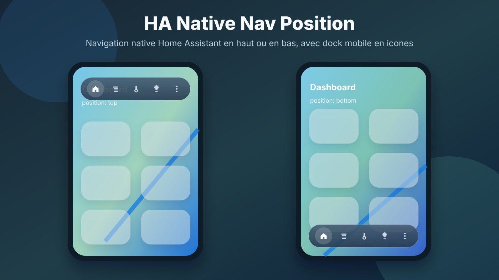

# HA Native Nav Position

[](https://github.com/hacs/integration)
[](https://github.com/Philiphall6/ha-native-nav-position/releases/latest)

Lovelace/HACS plugin that moves the native Home Assistant dashboard navigation to the top or bottom of the screen, with a compact mobile dock and icon-only view tabs.



## HACS Installation

Until this repository is accepted into the HACS default repository list, install it as a custom Dashboard repository.

[](https://my.home-assistant.io/redirect/hacs_repository/?owner=Philiphall6&repository=ha-native-nav-position&category=plugin)

1. Open **HACS** in Home Assistant.
2. Open the menu in the top-right corner and choose **Custom repositories**.
3. Add this repository URL:

```text
https://github.com/Philiphall6/ha-native-nav-position
```

4. Set the repository type to **Dashboard**.
5. Click **Add**, then install **HA Native Nav Position**.
6. Make sure the Lovelace resource points to:

```yaml
url: /hacsfiles/ha-native-nav-position/ha-native-nav-position.js
type: module
```

HACS installs the published file from `dist/ha-native-nav-position.js`.

## Updating From HACS

After a new version is published:

1. Open **HA Native Nav Position** in HACS.
2. Run **Update information**.
3. Run **Redownload** or **Update** if HACS offers an update.
4. Refresh the Home Assistant frontend. On mobile, fully close and reopen the app if the old version is still cached.

## Basic Configuration

By default, the plugin places the navigation bar at the bottom on mobile:

```yaml
url: /hacsfiles/ha-native-nav-position/ha-native-nav-position.js
type: module
```

Configure this navigation from the HACS resource, not from the Home Assistant theme. Keep your theme free of `card-mod-root` overrides for this bar so future design fixes can be delivered through HACS.

## Position

Force the bottom position:

```yaml
url: /hacsfiles/ha-native-nav-position/ha-native-nav-position.js?position=bottom
type: module
```

Restore the top position:

```yaml
url: /hacsfiles/ha-native-nav-position/ha-native-nav-position.js?position=top
type: module
```

## Options

Options can be passed through the resource URL:

```yaml
url: /hacsfiles/ha-native-nav-position/ha-native-nav-position.js?position=bottom&dock=true&hide_labels=true&mobile_only=true
type: module
```

| Option | Default | Description |
| --- | --- | --- |
| `position` | `bottom` | Navigation position: `bottom` or `top`. |
| `mobile_only` | `true` | Applies the styling only below `mobile_max_width`. |
| `mobile_max_width` | `768px` | Maximum width for mobile mode. |
| `dock` | `true` | Enables the floating dock style. |
| `hide_labels` | `true` | Hides navigation labels. |
| `compact` | `true` | Uses a 48px touch target with a 24px icon, matching native Home Assistant buttons. |
| `offset` | `18px` | Distance from the top or bottom edge. |
| `height` | `64px` | Dock height. |
| `tab_y_offset` | `0px` | Vertical offset for dashboard view icons. Keep `0px` to align them with the native menu and overflow buttons. |
| `active_color` | `var(--accent-color, var(--primary-color))` | Active view icon color, inherited from the current Home Assistant theme. |
| `inactive_color` | `rgba(255, 255, 255, 0.78)` | Inactive view icon color. |

## View Icons

For an icon-only navigation bar, each Lovelace view must define an icon:

```yaml
views:
  - title: Home
    path: home
    icon: mdi:home-variant
  - title: Shutters
    path: shutters
    icon: mdi:window-shutter
```

The plugin can hide labels, but it cannot automatically guess which icon should represent each room or view.

## Optional Invisible Card

If you want to override the configuration from a dashboard view, add this card to one view:

```yaml
type: custom:ha-native-nav-position
position: bottom
mobile_only: true
dock: true
hide_labels: true
```

The card is invisible and takes no layout space. For consistent behavior when directly opening any view, prefer configuring the plugin through the Lovelace resource URL.

## Notes

This plugin modifies the native Home Assistant frontend in the browser. If Home Assistant changes its internal navigation structure, a plugin update may be required.
